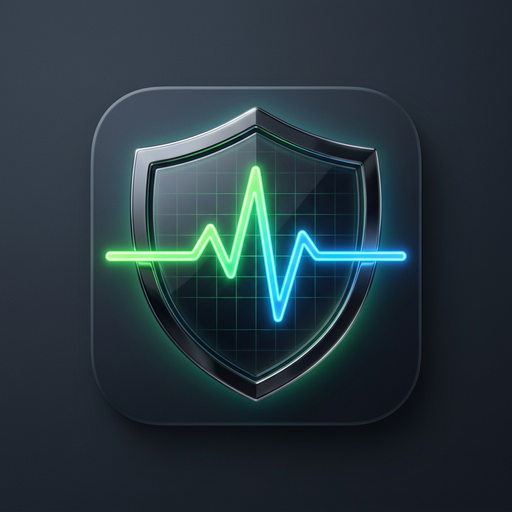
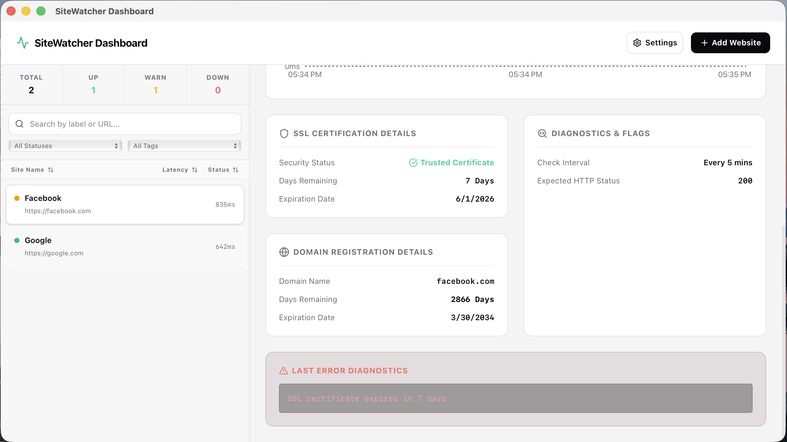
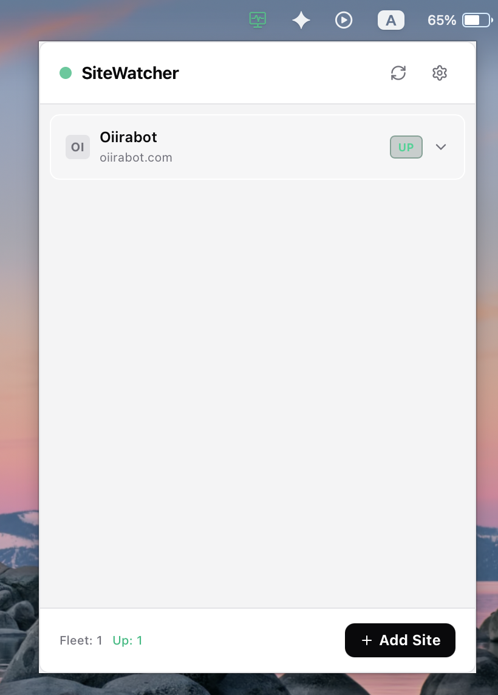
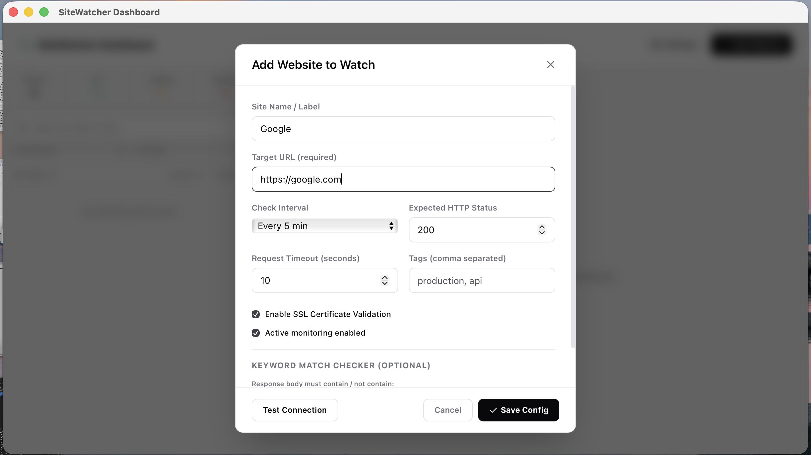

<p align="center">
  
</p>

# 🌐 SiteWatcher

SiteWatcher is a premium, lightweight, real-time website and SSL/Domain monitor that lives directly in your system tray. Built with **Tauri v2**, **Rust**, and **React + TypeScript**, it monitors status codes, response times, SSL certificates, and domain registration lifespans without cluttering your workspace.

> [!NOTE]
> 🔮 **Vibe Coding Project**
> This application was built using modern "vibe coding"—co-created through agentic AI pair programming with **Antigravity**. It represents a rapid iteration cycle of Rust and TypeScript code guided by design systems, standard libraries, and responsive UI components.

---

## 📷 Screenshots

| Main Dashboard | System Tray Popover | Add/Edit Monitor |
| :---: | :---: | :---: |
|  |  |  |

---

## ✨ Features

- **System Tray Integration:** Run in the background with a dynamic, color-coded icon indicating overall network status (Green = Up, Yellow = Warnings, Red = Down).
- **Custom Site Configs:** Configure check intervals, timeout thresholds, expected status codes, and custom tags for each site.
- **SSL Certificate Monitoring:** Automatically parses TLS peer certificates to track expiration dates and display remaining days. Warns when certificates are close to expiring.
- **Domain Expiration Tracking:** Automatically queries registrars using the **RDAP protocol** to extract domain registration expiration.
  - Resolves subdomains (like `www.google.com`) to their apex domains (like `google.com`) automatically.
  - Smart 24-hour caching to prevent registrar rate limits.
  - Visual status alerts when a domain is within 30 days of expiration.
- **Keyword Auditing:** Ensure specific words are present (or absent) inside the HTML body.
- **Visual Analytics:** Premium dark-mode dashboard featuring historic latency sparklines, responsive Area Charts, and real-time event updates via Tauri event bridges.
- **Smart Notification Fatigue:** System notification integration equipped with configurable cooldown states.

---

## 🛠️ Tech Stack

- **Backend:** [Rust](https://www.rust-lang.org/), [Tauri v2](https://tauri.app/)
- **Frontend:** [React](https://react.dev/), [TypeScript](https://www.typescriptlang.org/), [Tailwind CSS](https://tailwindcss.com/)
- **Database:** SQLite (managed via [rusqlite](https://github.com/rusqlite/rusqlite) in Rust)
- **Charts:** [Recharts](https://recharts.org/)
- **Icons:** [Lucide React](https://lucide.dev/)

---

## 🚀 Getting Started

### Prerequisites

Ensure you have installed the native dependencies required for Tauri development on your platform:

- **macOS:**
  ```bash
  xcode-select --install
  ```
  *(Make sure Rust is installed via `rustup`)*
- **Windows:** Check out [Tauri Prerequisites](https://v2.tauri.app/start/prerequisites/#windows) for C++ Build Tools & WebView2 runtime.

### Installation

1. Clone the repository.
2. Install frontend and build dependencies:
   ```bash
   npm install
   ```

### Running Development Server

Start the React development server along with the Tauri desktop container:

```bash
npm run tauri dev
```

### Production Build

Compile the application and package it as a native installer:

```bash
npm run tauri build
```
- **macOS:** Generates `.app` and `.dmg` installers under `src-tauri/target/release/bundle/`.
- **Windows:** Generates `.exe` and `.msi` installers (must be run on a Windows host or CI runner).

---

## 🖥️ Cross-Compilation for Windows

Because Tauri links to native operating system webviews and packaging tools, you cannot build Windows binaries directly on macOS.

### 1. GitHub Actions (Recommended)
You can configure a workflow inside `.github/workflows/release.yml` using `tauri-apps/tauri-action`. This will spin up Windows runners, compile the code, and package it into draft releases automatically on tag pushes.

### 2. Local Virtual Machine
Install Windows 11 inside a virtual machine (using Parallels, UTM, or VirtualBox) on your Mac, configure Rust and Node.js, and run:
```bash
npm run tauri build
```

---

## 📂 Project Structure

```
sitewatcher/
├── src-tauri/                 # Rust backend code (Tauri container)
│   ├── src/
│   │   ├── main.rs            # Desktop App Entry point & tray setup
│   │   ├── lib.rs             # Tauri command registrations & handlers
│   │   ├── db.rs              # SQLite connection, schemas, and migrations
│   │   ├── checker.rs         # Async checker, RDAP domain query, SSL parser
│   │   └── commands.rs        # Tauri IPC commands
│   └── Cargo.toml             # Rust configuration & crates
├── src/                       # Frontend code (React + TypeScript)
│   ├── components/            # UI components (Dashboard, StatusPopover, StatusTicks)
│   ├── store.ts               # Zustand store containing local state & Tauri IPC
│   ├── main.tsx               # React application entry point
│   └── index.css              # Custom Tailwind/CSS layout rules
├── package.json               # Frontend dependencies & package configurations
└── vite.config.ts             # Vite build settings & configuration
```
